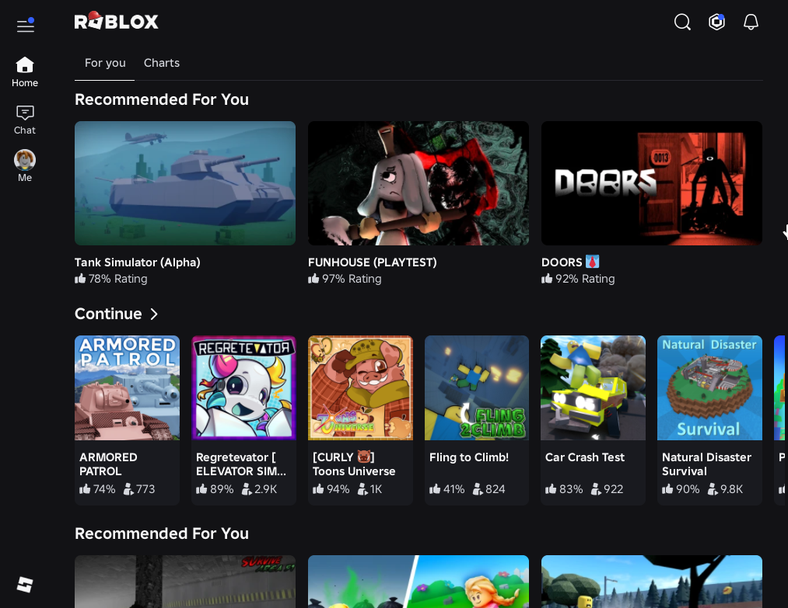
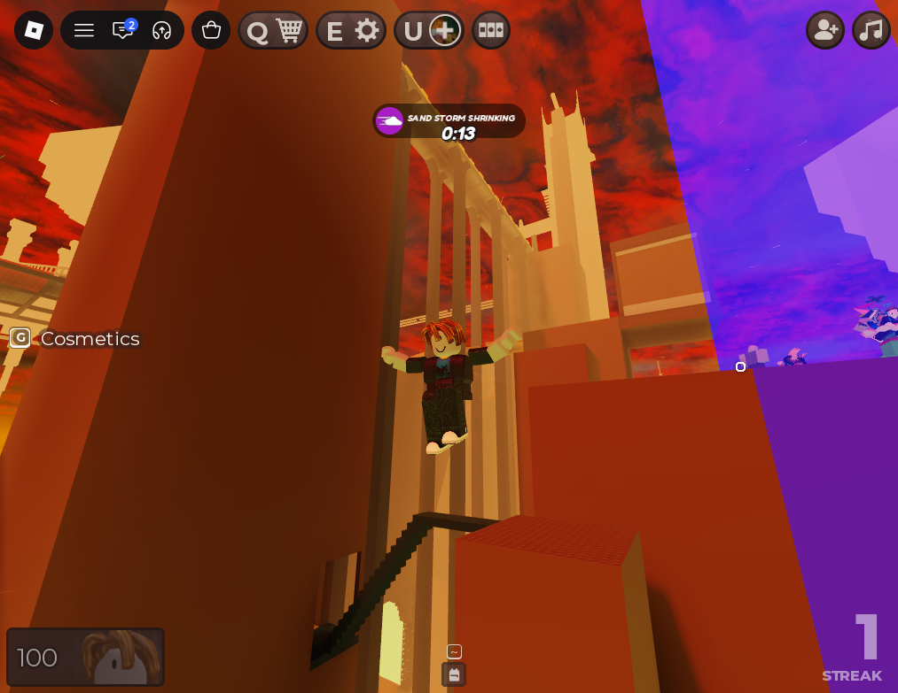
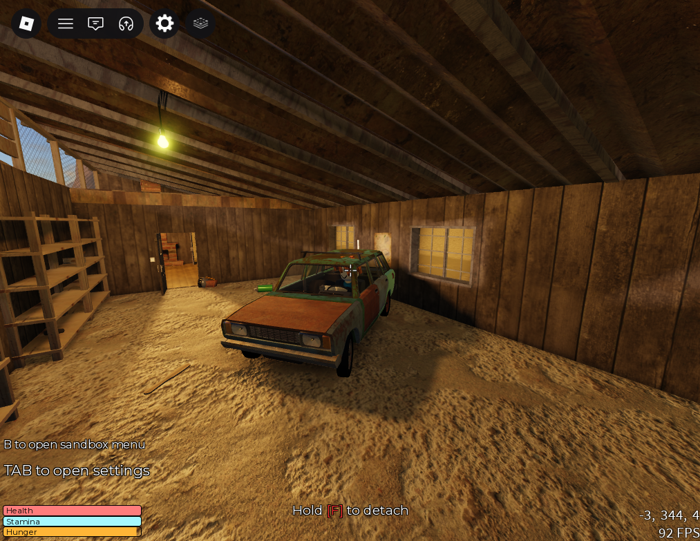
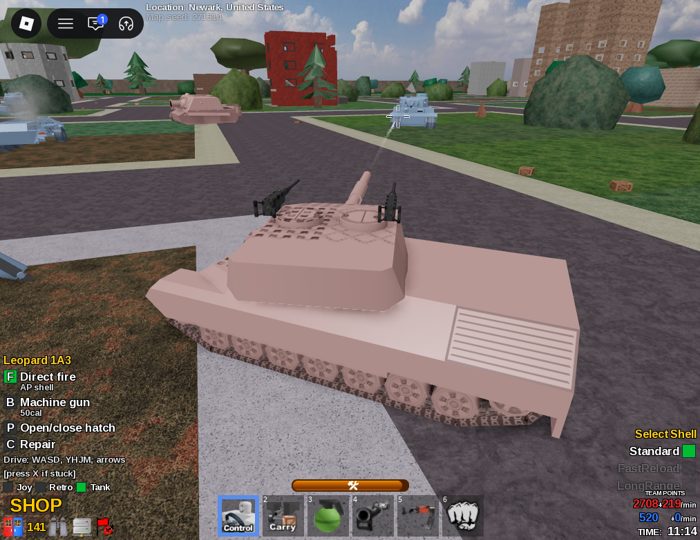
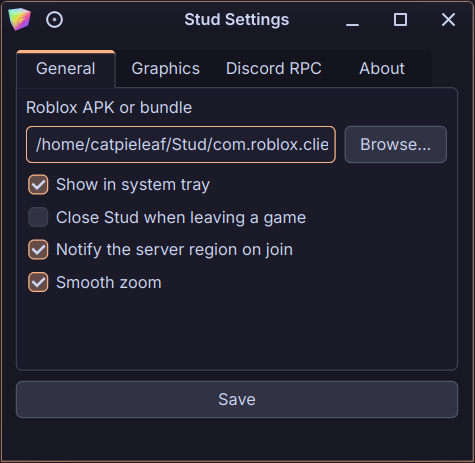
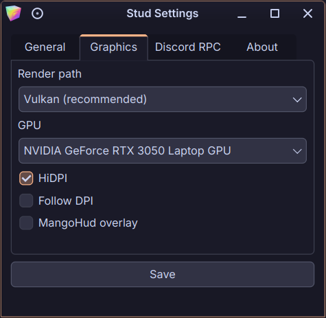
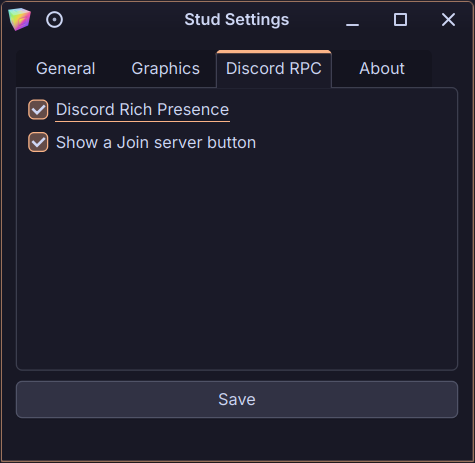
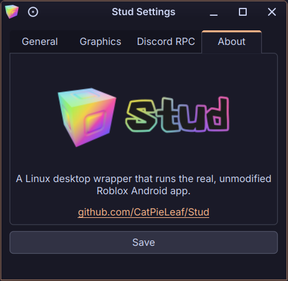

<div align="center">
  </img>
  <br/>
</div>

<div align="center">

<p align="center">
  
  
  
  <a href="https://discord.gg/MQRGatcqMb"></a>
</p>

  <p align="center">Play Roblox on Linux — the real Android app, running on your desktop.</p>
</div>

<p align="center">Stud is a <b>launcher</b>. It takes the real, unmodified Roblox Android app and gives it everything a phone would have given it — the Android framework, a window, a mouse and keyboard, a graphics stack — so it runs on a Linux desktop instead. Roblox itself is never touched, never patched, and never shipped from here.</p>

<div align="center">

[Screenshots](#screenshots) · [Why?](#why) · [Features](#features) · [Status](#status) · [What Stud is not](#not)

[How it works](#how) · [Building](#building) · [Installation](#installation) · [Where things live](#files) · [Credits](#credits)

</div>

<br>
<div align="center">
  <h1>🖼️</h1>
  <h4 id="screenshots">S C R E E N S H O T S</h4>
</div>

<div align="center">
  </img>
  <p><i>The real Roblox home screen, on a Linux desktop.</i></p>
</div>

<table align="center">
  <tr>
    <td><a href="packaging/screenshots/game1.png"></a></td>
    <td><a href="packaging/screenshots/game2.png"></a></td>
    <td><a href="packaging/screenshots/game3.png"></a></td>
  </tr>
</table>

<table align="center">
  <tr>
    <td><a href="packaging/screenshots/settings1.png"></a></td>
    <td><a href="packaging/screenshots/settings2.png"></a></td>
    <td><a href="packaging/screenshots/settings3.png"></a></td>
    <td><a href="packaging/screenshots/settings4.png"></a></td>
  </tr>
</table>

<br>

<div align="center">
  <h1>🤔</h1>
  <h4 id="why">W H Y ?</h4>
</div>

<div align="center">
  <p><i>Honestly? Because the existing options to play Roblox on Linux kept falling over. NVIDIA, Vulkan, mid-game — often enough that playing stopped being the point and finding out why started being the point. That is one person's experience on one set of hardware, not a verdict on anyone else's work; your mileage may genuinely vary.<br><br>
  The first version of Stud made things worse in an interesting way: one process doing everything, Android code and desktop code taking turns on the same threads, a graphics driver spinning up worker threads nobody asked for in the middle of it. It crashed in places that made no sense until it became clear the design itself was the bug.<br><br>
  So it got taken apart. Three processes now, each with one job, borrowing the shape a web browser has used for years — and most of the crashes stopped being possible rather than being fixed.<br><br>
  This is a project made entirely by one person, in two months, who just wanted to have a better experience playing Roblox.</i></p>
</div>

<br>

<div align="center">
  <h1>✨</h1>
  <h4 id="features">F E A T U R E S</h4>
</div>

 - Runs the **real, unmodified** Roblox Android app
 - Three separate processes in the shape of a browser's — the same split CEF and Chromium use, so the GPU driver never shares a process with the engine. No crashes with NVIDIA at all.
 - Vulkan by default, with OpenGL through ANGLE, OpenGL, and software-rendering in Settings
 - **AMD FSR upscaling** — the game renders below your screen's resolution and Stud rebuilds the frame at full size, with adjustable sharpening
 - Smooth zoom in/out just like Windows client
 - Your login lives in the system keyring — never in Stud's config, cache or logs
 - `roblox://` links from a browser open straight into the experience
 - In-app web panels — Messages, account pages, login challenges — and private servers joined from the server list
 - Copy Link in an experience puts the real invite link on your clipboard
 - Discord Rich Presence, with a join button
 - Tells you which country the game server is in when you join
 - MangoHud overlay toggle, HiDPI and UI scaling, GPU picker, system tray
 - Caps the frame rate while nothing can see the window — minimised, covered, or on another workspace
 - Export every session log as one tarball, for when you file a bug
 - Ships as an **rpm**, a **deb**, an Arch **pkg.tar.zst**, a universal **AppImage**, and a **Flatpak** — plus an [AUR](https://aur.archlinux.org/packages/stud) package and a [cpak](https://github.com/Containerpak/cpak) **(Planned)**

<br>

<div align="center">
  <h1>⚠️</h1>
  <h4 id="status">W O R K  -  I N  -  P R O G R E S S</h4>
</div>

> [!WARNING]
> **Stud is very unstable.** It boots, it logs in, it renders the real app and it joins real games — and it also breaks, hangs and does strange things, sometimes for reasons nobody has measured yet. For now, treat it as something to tinker with, not something to rely on.

**Contributions of any kind are welcome** — code, bug reports, a log from a machine that isn't ours, a GPU we've never tested on, a screenshot of something rendering wrong. Nothing is too small. Open an [issue](https://github.com/CatPieLeaf/Stud/issues) and say what happened; the tray's **Export logs** puts every session in one file for you.

<br>

<div align="center">
  <h1>📜</h1>
  <h4 id="not">W H A T _ S T U D _ I S _ N O T</h4>
</div>

 - **Not affiliated with Roblox.** Stud is an independent project, not endorsed, supported or approved by Roblox Corporation in any way.
 - **Not a distributor.** No Roblox APK is included here, mirrored here, or downloaded by anything here. You supply your own copy, and Roblox remains subject to its own terms.
 - **Not a modding tool.** Stud does not inject code, patch the client, alter game behaviour or give you anything you would not have on a regular client — and it will not gain support for doing so. Requests for that will be ignored and closed.
 - **Not borrowed.** Stud shares no code with any similar project. Not a single line comes from Sober or anything like it; everything here was written for this project.
 - **Not an emulator.** There is no Android system image and no virtual machine. The app's own code runs directly, with the pieces it expects supplied around it.

<br>

<div align="center">
  <h1>🧩</h1>
  <h4 id="how">H O W _ I T _ W O R K S</h4>
</div>

Three processes, talking over a Unix socket:

| process | runs as | does |
|---|---|---|
| `stud-ui` | glibc, Qt6 | settings, deep links, starting the other two — then gets out of the way |
| `stud-runtime-bionic` | real bionic, inside `bwrap` | the engine, the JNI bridge, the Android framework stand-in |
| `stud-render-host` | glibc | Wayland or X11, ANGLE, the real Vulkan surface, audio |

Every GL and Vulkan call the engine makes is forwarded from the bionic process to the render host over that socket. It is the only place the two worlds meet, and it is Stud's own code on both sides.

<br>

<div align="center">
  <h1>🔨</h1>
  <h4 id="building">B U I L D I N G</h4>
</div>

> [!NOTE]
> The long part is ANGLE, which builds from source and takes about an hour. Everything else is minutes. You need roughly **10 GB** of free space for the dependencies.

### 1 - Install the system packages

Qt 6 (base, webengine, keychain), Wayland client and `wayland-egl`, EGL/GLESv2 headers, the Vulkan loader and headers, PortAudio, `bubblewrap`, `cmake`, `ninja` and a C++20 compiler. `wl-clipboard` (or `xclip` on X11) is what "copy link" copies with.

```bash
sudo dnf install cmake ninja-build gcc-c++ qt6-qtbase-devel qt6-qtwebengine-devel \
  qtkeychain-qt6-devel wayland-devel wayland-protocols-devel libxkbcommon-devel \
  libglvnd-devel vulkan-loader-devel vulkan-headers freetype-devel \
  portaudio-devel openssl-devel bubblewrap wl-clipboard
```

<details>
<summary>Debian / Ubuntu</summary>

```bash
sudo apt install cmake ninja-build build-essential qt6-base-dev qt6-webengine-dev \
  qtkeychain-qt6-dev libwayland-dev wayland-protocols libwayland-egl-backend-dev \
  libxkbcommon-dev libegl1-mesa-dev libgles2-mesa-dev libvulkan-dev libfreetype-dev \
  portaudio19-dev libssl-dev bubblewrap wl-clipboard
```
</details>

### 2 - Dependencies

Three things are not in this repository and cannot be: Google's NDK, an ANGLE build, and a real bionic taken from AOSP. This gets all three into `third_party/`.

```bash
tools/setup.sh --plan   # what it would fetch, and from where
tools/setup.sh          # actually fetch it
```

> [!TIP]
> Already have an NDK or an ANGLE build lying around? Point at them and skip the downloads:
> ```bash
> STUD_NDK_SRC=/path/to/android-ndk-r28c STUD_ANGLE_SRC=/path/to/angle/out/Release tools/setup.sh
> ```

### 3 - Build

```bash
cmake -S . -B build -G Ninja
cmake --build build
```

### 4 - Run it

```bash
./build/ui/stud-ui
```

First launch opens Settings, because Stud has no Roblox APK yet — point it at one you obtained yourself and save. That extracts what it needs; every launch after that goes straight to Roblox.

<details>
<summary>Making packages</summary>

Both ship everything Stud needs — ANGLE, the bionic set, the runtime process — on top of what they declare as dependencies. Neither contains Roblox.

```bash
cd build && cpack -G RPM      # build/stud-<version>-1.x86_64.rpm
packaging/build-appimage.sh   # build-appimage/packages/Stud-x86_64.AppImage
```

The AppImage builds itself inside a container so that what it links against is a decision rather than an accident of the machine that built it. It needs `podman` or `docker`.
</details>

<details>
<summary>Running the tests</summary>

```bash
cd build && ctest
```
</details>

<br>

<div align="center">
  <h1>📦</h1>
  <h4 id="installation">I N S T A L L A T I O N</h4>
</div>

Pre-built packages are on the [Releases](https://github.com/CatPieLeaf/Stud/releases) page.

## 🔵 R P M  ( F E D O R A )

```bash
sudo dnf install ./stud-*.x86_64.rpm
```

Stud then shows up in Discover, GNOME Software and your application menu like anything else.

## 🟣 D E B  ( D E B I A N  /  U B U N T U )

```bash
sudo apt install ./stud_*_amd64.deb
```

Built against whatever Qt the distribution carries, so an Ubuntu LTS gets a package
that matches its own Qt rather than one that refuses to install.

## 🔷 A R C H  ( P A C M A N )

```bash
sudo pacman -U stud-*-x86_64.pkg.tar.zst
```

Or build it from source with the [AUR](https://aur.archlinux.org/packages/stud)
package — `paru -S stud`, and expect around an hour, almost all of it ANGLE:

```bash
git clone https://aur.archlinux.org/stud.git && cd stud && makepkg -si
```

## 🔶 F L A T P A K  ( N O T _ Y E T _ O N _ F L A T H U B )

The manifest is in `packaging/flatpak` and works, but Stud is not on Flathub yet, so
there is nothing to `flatpak install` from a remote. Building it yourself:

```bash
flatpak install -y flathub org.kde.Sdk//6.8 org.kde.Platform//6.8
flatpak-builder --force-clean --user --install build-flatpak \
  packaging/flatpak/io.github.catpieleaf.Stud.yml
flatpak run io.github.catpieleaf.Stud
```

The `*-flatpak.tar.zst` attached to releases is what that manifest installs — it is
not something to install directly.

## ⬛ C P A K  ( N O T _ Y E T _ P U B L I S H E D )

[cpak](https://github.com/Containerpak/cpak) installs an application from an OCI
image and runs it rootless. The `Containerfile` and the manifest are in
`packaging/cpak`, but the image is not published yet, so this does not work until it
is:

```bash
cpak install github.com/CatPieLeaf/Stud
```

## 🟠 A P P I M A G E  ( A N Y _ D I S T R O )

```bash
chmod +x Stud-x86_64.AppImage
./Stud-x86_64.AppImage
```

> [!TIP]
> An AppImage installs nothing, so nothing knows it exists yet. Run this once to get a taskbar icon and to make `roblox://` links from your browser open Stud:
> ```bash
> ./Stud-x86_64.AppImage --install-desktop-entry
> ```

> [!NOTE]
> `bubblewrap` is deliberately **not** bundled in the AppImage — it needs the AppArmor or SELinux policy your own distribution ships alongside it. Install it from your package manager (`bubblewrap`); the AppImage will tell you if it is missing. The rpm, deb and Arch packages depend on it, so those pull it in for you, and the Flatpak builds its own inside the sandbox.
>
> The AppImage carries its own Qt and Breeze, which puts a floor of glibc 2.41 on it: Fedora 42+, Ubuntu 25.04+ and current rolling releases. Older than that, build from source or use the rpm.

<br>

<div align="center">
  <h1>🗂️</h1>
  <h4 id="files">W H E R E _ T H I N G S _ L I V E</h4>
</div>

| path | what |
|---|---|
| `~/.config/stud/` | `config.json`, and `flags.json` if you hand-write FFlag overrides |
| `~/.local/share/stud/` | the keyring entry and the engine's own data |
| `~/.cache/stud/` | the extracted APK, assets and caches — safe to delete |
| `~/.local/state/stud/logs/` | one log per session, written by all three processes |

That last one is the file to read when something goes wrong, and the one to attach to a bug report.

<br>

<div align="center">
  <h1>📑</h1>
  <h4 id="credits">C R E D I T S </h4>
</div>

 - Roblox is a trademark of Roblox Corporation. Stud is an independent, non-commercial project and is not affiliated with, endorsed by or supported by them.
 - [ANGLE](https://chromium.googlesource.com/angle/angle) — the GL translation layer (BSD)
 - [bionic](https://android.googlesource.com/platform/bionic/) — Android's own C library, taken from AOSP's prebuilt Runtime APEX (BSD / Apache-2.0)
 - [libjnivm](https://github.com/ChristopherHX/libjnivm) — the JNI virtual machine Stud's Java layer stands on (MIT)
 - [AMD FidelityFX Super Resolution 1](https://github.com/GPUOpen-Effects/FidelityFX-FSR) — Stud's upscaler is EASU and RCAS ported from AMD's own reference headers, vendored at `third_party/fidelityfx-fsr1` (MIT)
 - [nlohmann/json](https://github.com/nlohmann/json), [miniz](https://github.com/richgel999/miniz), [detex](https://github.com/hglm/detex), [PVRTDecompress](https://github.com/powervr-graphics/Native_SDK), [PortAudio](https://www.portaudio.com/) (MIT)
 - Qt, and on the AppImage the Breeze widget style (LGPL)

Stud itself is **AGPLv3**. Stud is and always will be Open Source.

---
<br>

<div align="center">
  </img>
</div>
